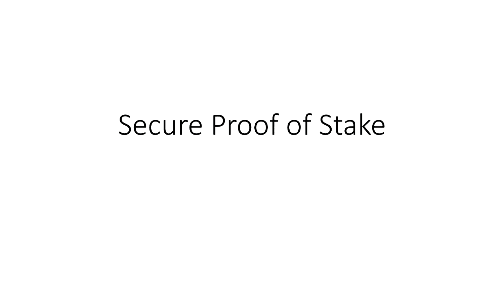

# 安全的股权证明

> 原文：<https://docs.elrond.com/technology/secure-proof-of-stake>

 埃尔隆德达成共识的方法被称为安全利害关系证明(SPoS)。它的创新之处在于从一个碎片中选择确认器节点进行共识的方式，以及确认器尽可能有效地完成共识过程所采取的步骤。让我们来看看。

在每一轮开始时，SPoS 使用一个既不能被预测也不能被影响的**随机源**来选择共识的验证者。它出奇的简单，只需要从前一个区块开始计算，并由当前一轮的共识领导者(也称为*区块提议者*)签署。得到的签名将是下一轮的随机性来源，并且由于它依赖于紧接在前面的块，它不能提前超过一轮被知道。

在每一轮中，都会选出一个新的共识小组来提出一个区块。但是该组中只有一个验证者将是**块提议者**。这是共识组中的验证器，它具有公钥的散列，随机性源在数字上最小。区块提议者将为该轮制作区块，共识小组的其他成员将验证并签署该区块。

随机选择共有群所需的时间非常短(大约 100 ms，通常更短)。这种效率是以下事实的结果:一旦随机性来源已知，共识选择就是确定性的，因此不存在通信要求。这使得总的循环时间只有几秒钟。

这么短的回合有一个安全优势:SPoS 是建立在这样一个前提上的，即恶意的参与者不能为了影响将要提议的区块而比一个回合所允许的时间框架适应得更快。

与其他利益相关证明方法一样，SPoS 根据操作者所标记的 EGLD 令牌数量来选择一致性验证节点。此外，每个验证者都有一个被考虑在内的单独的**评级分数**——仅利益相关者可能会影响，但不会完全决定共识的选择。评级表达了特定验证者的过去行为，并且在共识选择期间被考虑:具有较高评级的验证者更有可能被选择。验证者的等级在每个时期结束时重新计算，当等级被立即调整时有一些特殊的例外。通过这种方式，SPoS 促进了验证者的精英管理，鼓励他们的操作者保持平稳运行。

共识组使用一个改进的具有两轮通信的 BLS 多重签名方案来签署由分组提议者产生的分组。请参考下面的动画，了解此过程的分步描述:

