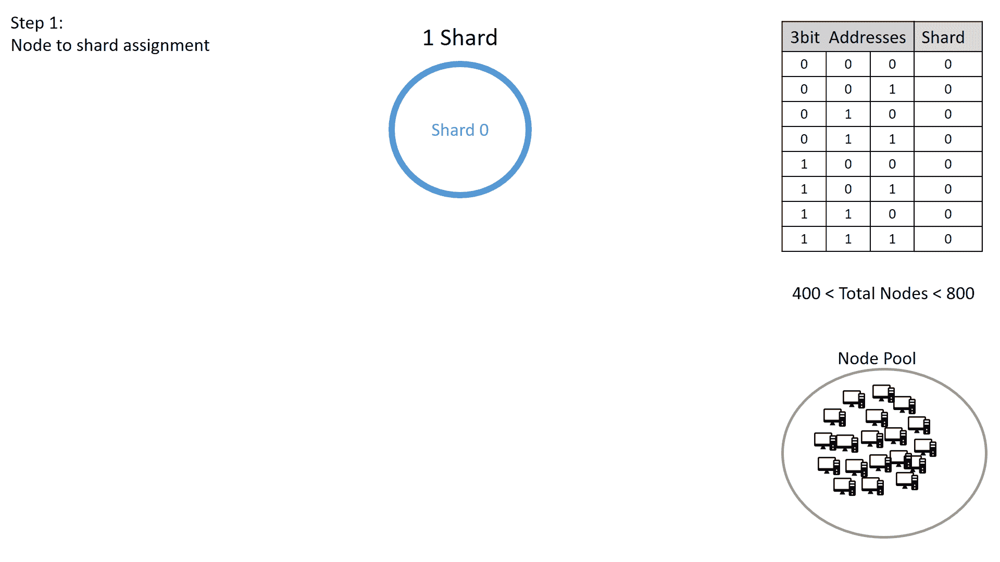
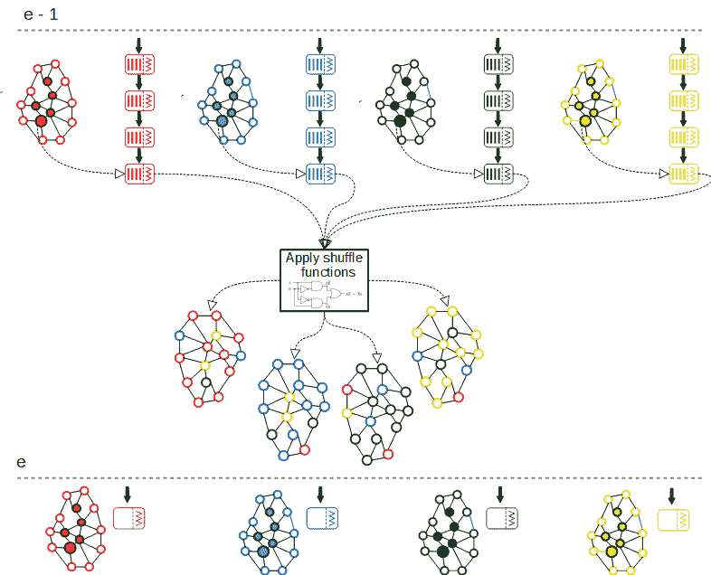

# 自适应状态共享

> 原文：<https://docs.elrond.com/technology/adaptive-state-sharding>

 分片最初用于数据库，是一种在多台机器上分发数据的方法。这使得它成为一种*扩展技术*，可以被区块链网络用来划分状态和事务处理，这样网络的每个节点只需要处理所有事务的一小部分。此外，分片允许并行处理事务。只要有足够数量的节点来验证每个事务，确保高可靠性和安全性，那么将区块链分成碎片将允许它通过并行化来处理更多的事务，从而大大提高事务吞吐量和效率。此外，随着网络的扩展和验证器数量的增加，分片有望增加网络的吞吐量——这是一种被称为*水平伸缩*的特性。

## **分片类型**

我们强调三种主要的分片类型:网络分片、事务分片和状态分片，这些将在下面的段落中描述。

**网络分片**处理将节点分组为分片的方式，可用于优化通信，因为分片内的消息传播比传播到整个网络要快得多。这是每个分片方法中的第一个挑战，将节点映射到分片的机制必须考虑到获得特定分片控制权的攻击者可能发起的攻击。

**事务分片**处理事务映射到它们将被处理的分片的方式。在基于账户的系统中，交易可以根据发送者的地址分配给碎片。

**状态分片**是最具挑战性的方法。与之前描述的所有节点存储整个状态的分片机制相反，在状态分片区块链的情况下，每个分片仅维护状态的一部分。如果事务中涉及的帐户位于不同的碎片中，执行该事务将需要在两个碎片中更新状态，并将涉及两个碎片的节点之间的消息交换。为了增加对恶意攻击的恢复能力，碎片中的节点必须不时地重新洗牌。然而，在碎片之间移动节点会引入同步开销，即新添加的节点从它们的新碎片下载最新状态所花费的时间。因此，必须在每个时期只重新分配所有节点的子集，以防止同步过程中的停机时间。

## **分片方向**

一些分片建议试图专注于事务分片或单独的状态分片，这增加了事务的吞吐量，或者通过迫使每个节点存储大量的状态数据，或者每个节点成为超级计算机。

分片引入了一些新的挑战，例如单分片接管攻击、潜在的密集跨分片通信、整体数据可用性以及对隐藏分片的抽象层的需求。然而，如果上述问题得到正确解决，状态分片会带来相当大的整体改进:由于并行事务处理，事务吞吐量将显著增加，事务费用将显著降低。这两个标准被广泛认为是主流采用区块链技术的主要障碍。埃尔隆德承担了将这些障碍转化为优势和激励因素的任务，以实现大规模主流采用。

# **埃尔隆德切分方法**

## **目标**

埃尔隆德网络中的分片是从头开始设计的，旨在解决组合**网络分片**、**事务分片**和**状态分片**的复杂性。结果是一个内聚的协议设计，它不仅实现了完全分片，而且还实现了以下目标:

1.  **不影响可用性的可伸缩性**，这要求增加或减少碎片的数量应该只影响可忽略不计的小范围节点，而不会导致停机时间，或者在更新状态时最小化停机时间。
2.  **快速调度和即时可追溯性**，这要求计算事务的目的碎片必须是确定性的，并且计算起来也很简单，从而消除了通信回合的需要。
3.  **效率和适应性**，这要求碎片在任何给定时间都应尽可能平衡。

下面的动画描述了一个简单的分步示例，展示了它的工作原理:

自适应状态共享工作流

## 节点洗牌

为了防止共谋，每个碎片的配置需要定期更改。埃尔隆德网络通过在每个时期结束时在碎片之间移动节点来做到这一点。虽然在每个时期中对所有节点进行重新洗牌将提供最高的安全级别，但是由于当节点与它们的新碎片重新同步时会出现额外的等待时间，因此这将对系统的活性产生不可忽略的影响。为了避免这些延迟，在每个时期结束时，属于一个碎片的合格验证器的仔细控制的比例将被非确定性地和均匀地重新分配给其他碎片。

混洗的节点将被放置在等待列表中的新碎片中，这意味着它们必须花费这个时期来执行与新碎片的重新同步。只有在新碎片的等待列表中度过一个完整的纪元后，节点才被允许成为*合格验证者*并完全加入该碎片。

洗牌过程的不可预测性对于网络的安全性是很重要的。出于这个原因，在每个时期的末尾，元链计算必须离开其碎片并移动到新碎片的节点列表。这些节点是使用在前面的元链块中计算的随机性源来选择的，这意味着选择和重新分配不能预先知道。这种计算是确定性的，因此不需要额外的通信。

节点重组图

在上图中， *e* 代表即将到来的网络，节点必须被洗牌，而 *e - 1* 代表即将结束的纪元。

节点改组过程必须考虑多个方面:

*   节点必须在碎片之间被混洗，同时还要保持碎片的平衡；
*   已经在碎片的等待列表中花费了一个时期同步的节点必须在各自的碎片中被提升到*合格验证者*状态。
*   可能存在已经注册到网络并等待加入的新节点。它们已经被放入*网络范围的等待列表*中，并且保持未分配给碎片，直到当前时期结束。
*   可能有节点已经发信号表示它们打算离开
*   网络拓扑可能需要更改。如果处理负载在分片之间不均匀，或者如果许多节点加入或退出网络，那么分片的数量必须改变。

为了产生新时代的分片配置，元链执行以下步骤:

1.  计算必须从每个碎片中洗出的节点的数量，然后这些节点从它们的碎片中被*取消分配*；
2.  基于碎片中的处理负载和将在即将到来的时期中形成网络的节点的数量，并且还考虑正在加入或离开的节点，计算整个网络的新的碎片数量；
3.  对于每个分片，先前在等待列表中花费了一个时期同步的节点被提升到该分片中的*合格验证者*；
4.  网络范围的等待列表中的节点(包括那些在步骤 1 中从其碎片中未被分配的节点)被随机且一致地重新分配给所有碎片，并放入它们的等待列表中，在那里它们将花费下一个时期与新碎片同步。

如前所述，在纪元开始时碎片的重新配置和在回合内任意选择验证器的