# 网络钱包

> 原文：<https://docs.elrond.com/wallet/web-wallet>

 使用钱包以安全的方式发送、接收和存储 EGLD。包括与产品和生态系统池交互的自动化。

## **创建新钱包**

前往[https://wallet.elrond.com](https://wallet.elrond.com/)T2】仔细确认所提供的说明。

点击 <create wallet="">:</create>

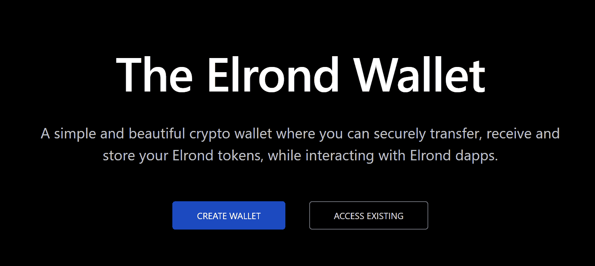

仔细阅读并确认信息，然后点击

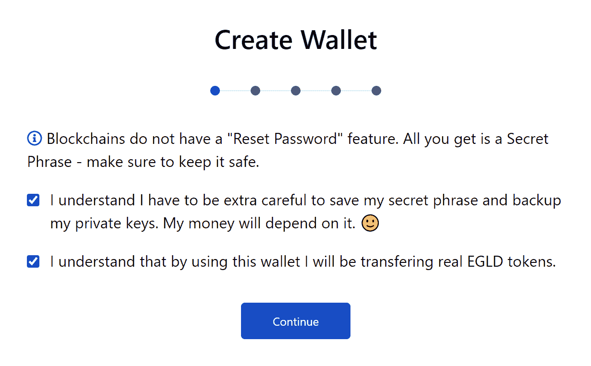

## **保存您的秘密短语！这一点非常重要。**

按顺序编号的单词是你的秘密短语。它们只在你的屏幕上显示一次，不会保存在服务器上或世界上的任何地方。你只有一次机会拯救他们-请现在就做。

单击“复制”(两个矩形)按钮，然后将它们粘贴到文本文件中。如果你的宠物通常不觉得重要的纸是美味的，你甚至可以写下这些话。

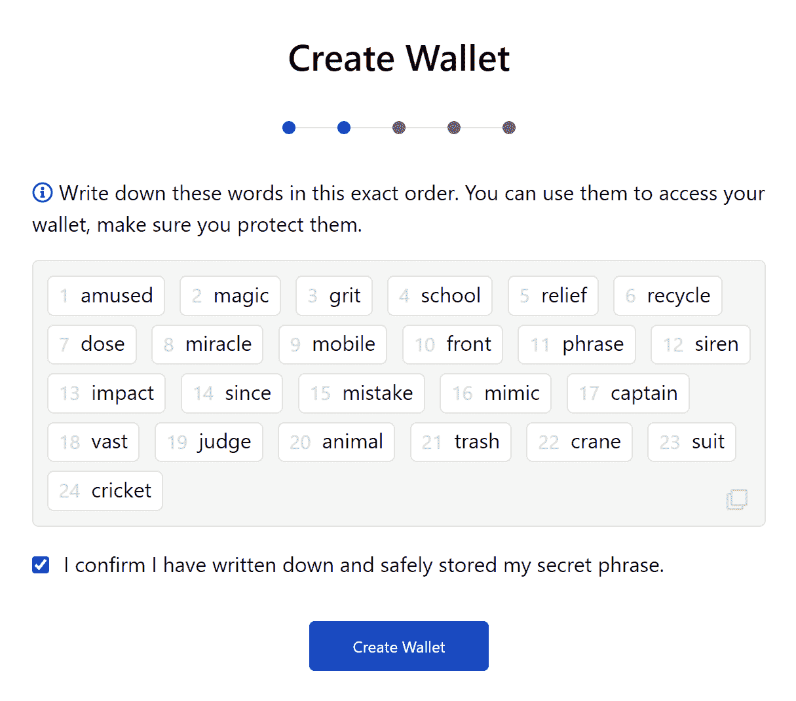

下一页是一个测试，看看你是否真的保存了秘密短语。按照提示输入随机单词，然后按

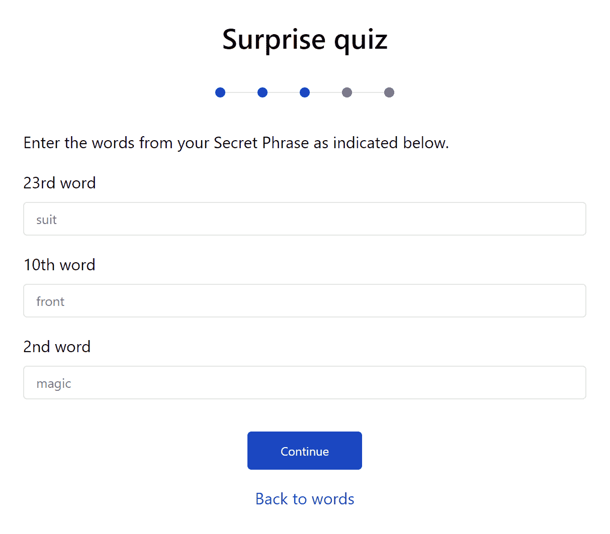

离获得密钥库文件只有一步之遥了。首先，用密码加密。确保它是强类型的，有 9 个字符，至少一个大写字母，一个$ymb@l 和 numb3r

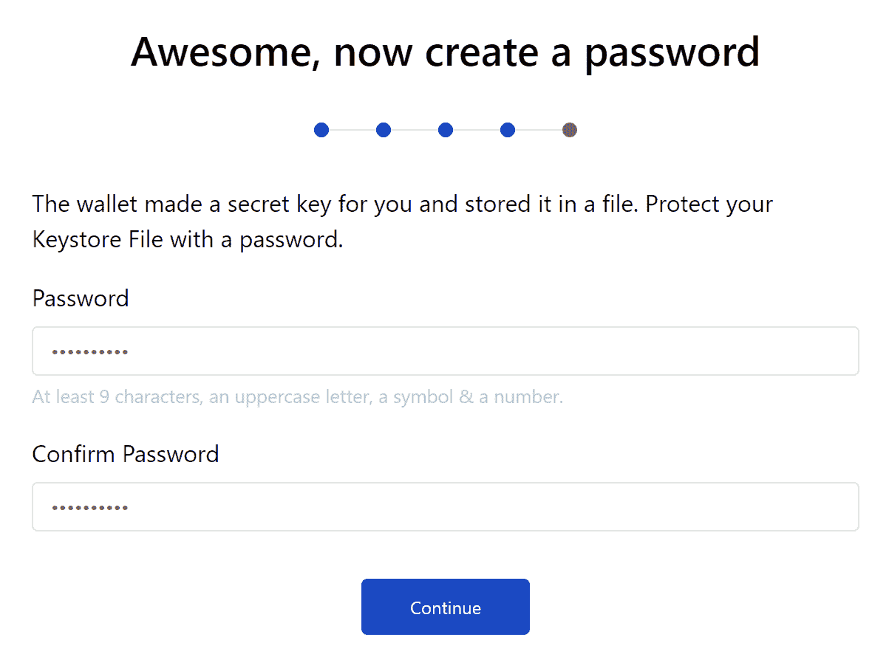

万一您忘记了这个密码，您可以用您的机密短语获得一个新的密钥库文件。记住它总是更好。

恭喜你，你有了一个新钱包！默认情况下，关联的密钥库文件被下载到浏览器保存文件的位置。该文件将钱包的实际地址作为默认名称，类似于“erd…json”。如果愿意，可以将其重命名为“something.json ”,这样更容易管理。

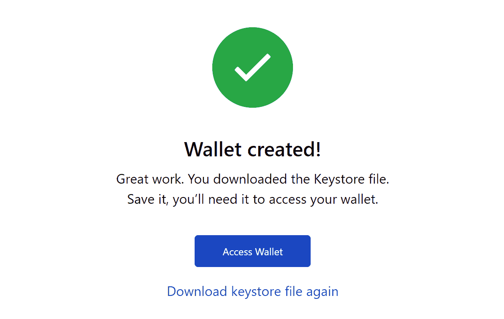

## **存取钱包**

转到[https://wallet.elrond.com/](https://wallet.elrond.com/)并单击<access existing="">确保选择了“密钥库文件”访问方法，单击浏览并找到您的密钥库文件[erd1…json]，然后输入你的密码，点击</access>

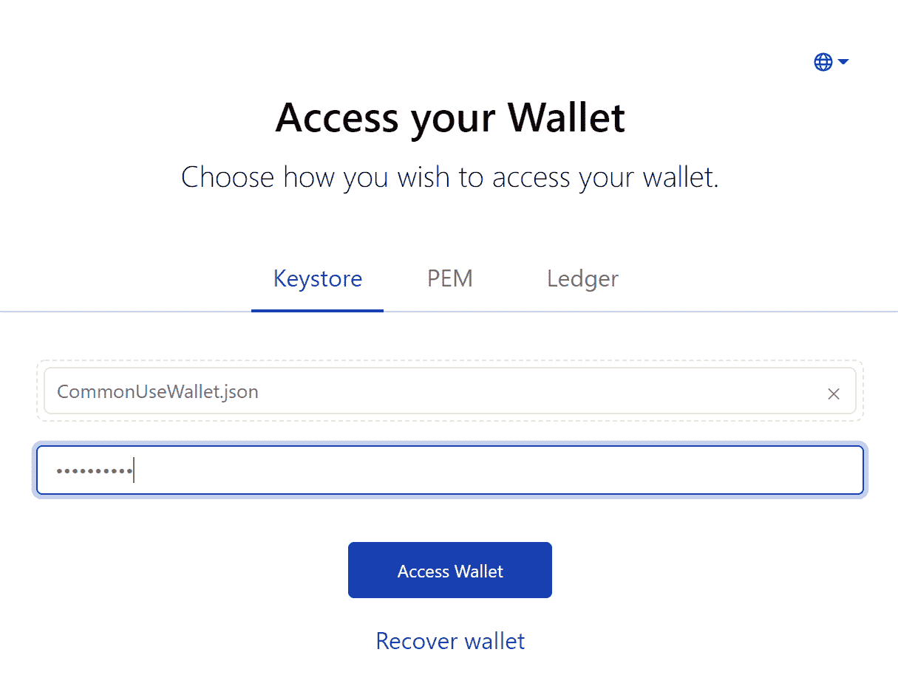

你被录取了。你的 EGLD 地址在最上面，你可以使用“复制”按钮(两个矩形)将其复制到剪贴板。

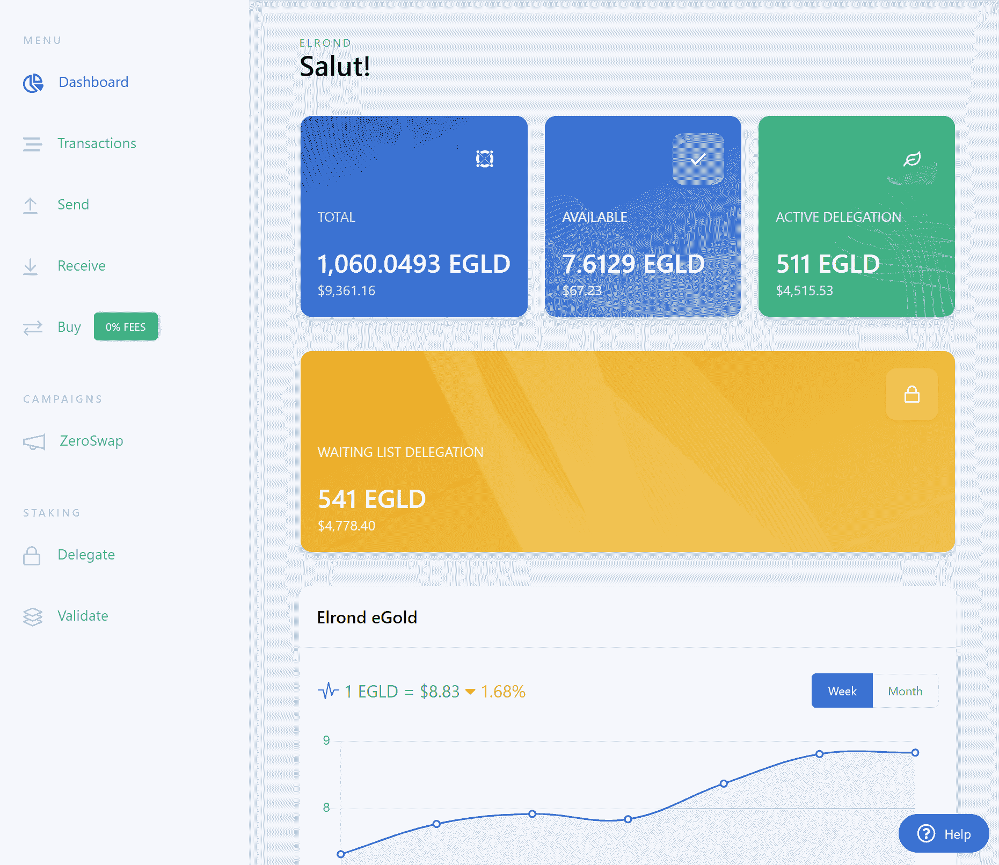

## **概述您的 EGLD 余额**

登录您的钱包后，您的 EGLD 余额立即可见，并显示在易于关注的框中。

*   **可用:**可自由转让的 EGLD 余额
*   **可领取的奖励:**可领取的委托奖励
*   **委托:**委托给赌注服务提供商的 EGLD 金额
*   **Total:** 与该地址相关联的 EGLD 的总量，以上总和

## **发送交易**

点击钱包左侧的“发送”:

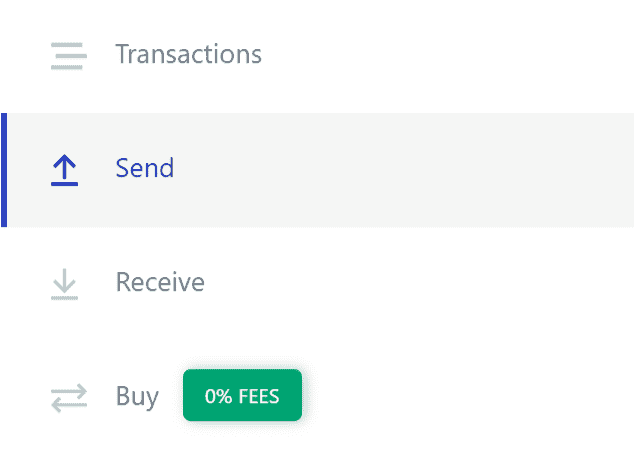

输入目的地地址和金额，然后点击

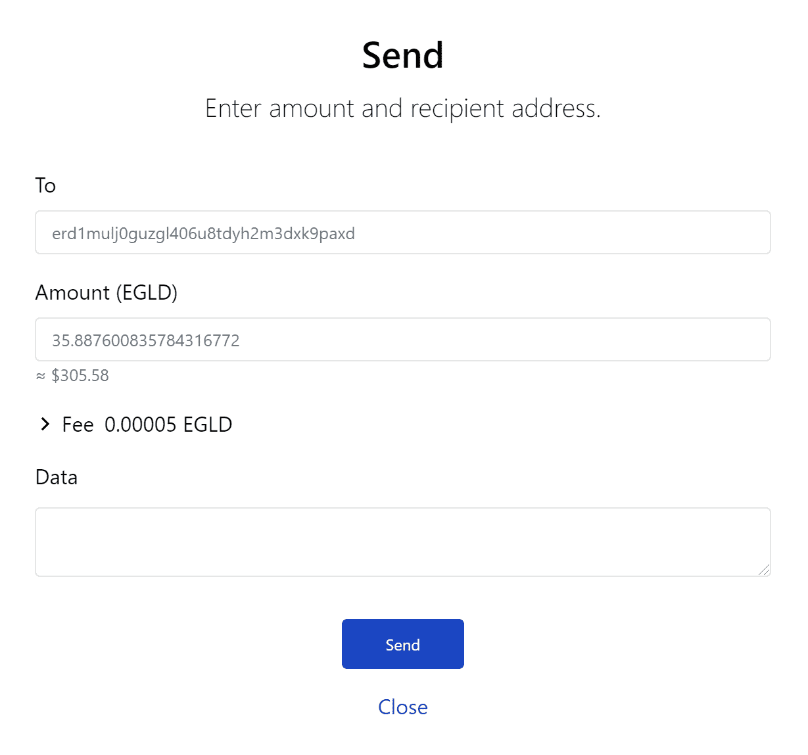

*   核实目的地和金额，点击“确认”

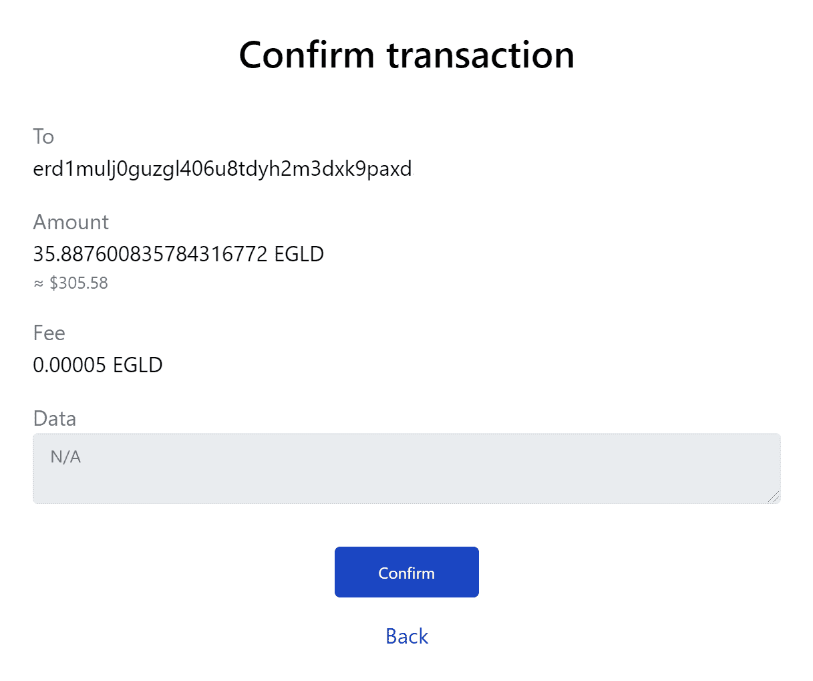

屏幕上会弹出一个小项目，指示交易的进度和完成情况。

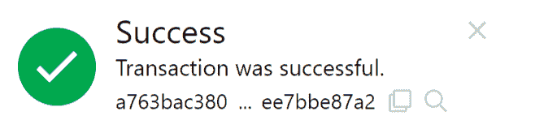

您可以随时在钱包左侧的“交易”菜单中查看您的交易历史。

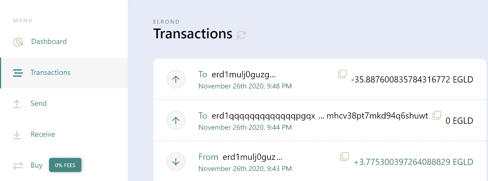

## **接收钱包里的 EGLD**

如上所述，登录您的钱包后，您将能够看到您的钱包地址并与其他人共享，这样他们就可以向您发送 EGLD。

您的地址会立即出现在钱包的顶部，显示为“地址 erd1 ...”。您可以按下复制按钮(两个重叠的方块)来复制地址。

你也可以点击左侧的“接收”来查看地址的二维码，扫描后可以显示公共地址。

## **Testnet 和 Devnet 龙头**

您可以在`Faucet`选项卡中从 [Testnet Wallet](https://testnet-wallet.elrond.com) 或 [Devnet Wallet](https://devnet-wallet.elrond.com) 请求测试代币。

水龙头在给定的时间段内只能使用一次。获取测试代币的另一种方法是:

*   在[电报上请求代币-验证器聊天](https://t.me/ElrondValidators)
*   使用第三方水龙头，如[https://r3d4.fr/faucet](https://r3d4.fr/faucet)