# Maiar 网络钱包扩展

> 原文：<https://docs.elrond.com/wallet/wallet-extension>

 通常被称为“金钱的未来”，Maiar 目前有一个强大的网络钱包扩展，称为 **Maiar DeFi 钱包扩展**。这是Elrond钱包的一个强大的浏览器扩展，有效地自动化并减少了用户与Elrond分散应用程序交互所需的步骤和时间。

Maiar DeFi 钱包可以安装在 Chrome、Brave 和其他基于 chromium 的浏览器上。该扩展是免费的、安全的，具有引人注目的功能，允许您创建新的钱包或导入现有的钱包，在Elrond mainnet 上管理多个钱包，以及在Elrond网络上存储 EGLD、ESDT 或 NFTs 等Elrond代币，并且易于访问。

让我们来看看如何安装和设置 Maiar DeFi Wallet 扩展的步骤:

## 先决条件

### 将 Maiar DeFi 钱包添加到浏览器中

*   在 [Chrome 网络商店扩展](https://chrome.google.com/webstore/category/extensions)上，搜索 **Maiar DeFi Wallet。**并将其添加到您的浏览器中。

    

*   确认弹出窗口中的操作。

    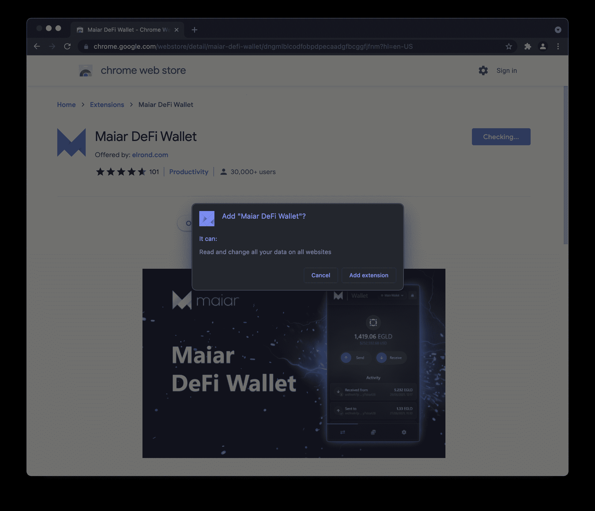

*   您应该会收到一个通知，告知您已经成功添加了扩展。

    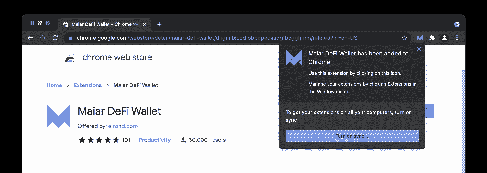

### 设置 Maiar DeFi 钱包

*   成功安装后，单击扩展即可开始。

*   您将看到两个选项:您可以*创建新钱包*或*导入现有钱包。*

    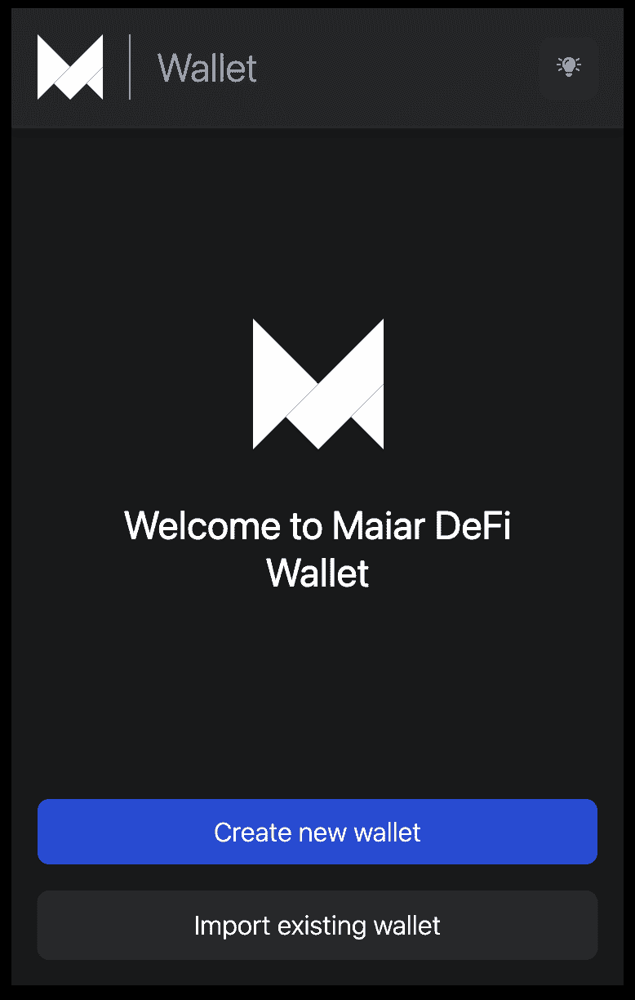

### 创建新钱包

**第一步:**首先安装 [Maiar DeFi 钱包扩展](https://chrome.google.com/webstore/detail/maiar-defi-wallet/dngmlblcodfobpdpecaadgfbcggfjfnm)。

**第二步:**打开扩展，点击*【创建新钱包】*。

**步骤 3:** 接下来，将显示由一组 24 个秘密单词组成的秘密短语。安全备份这些密语。我们强烈建议您将它们写下来或复制并存储在安全的地方，就像密码管理器一样。这些密语是你钱包账户的密钥，一旦丢失就无法找回。

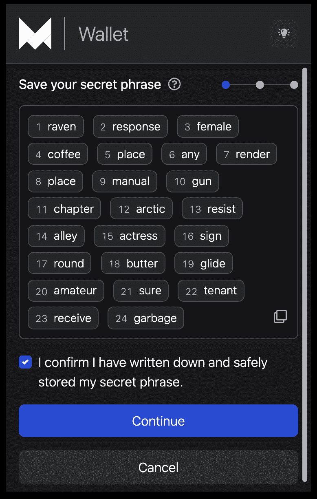

**步骤 4:** 在进行下一步之前，请确认您已经安全地存储了您的机密短语。

**第五步:**为了进一步验证，会提示您输入部分密语。

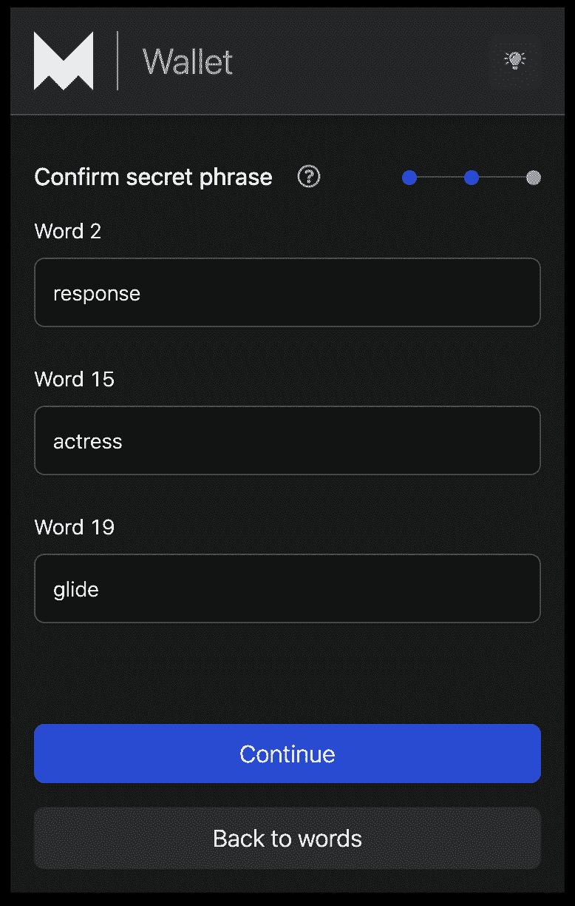

**步骤 6:** 创建一个密码，用于访问 Maiar DeFi 钱包扩展中存储的钱包。请确保您保管好此密码，因为它将被用来定期访问您的钱包。请注意，如果密码丢失，将无法恢复。

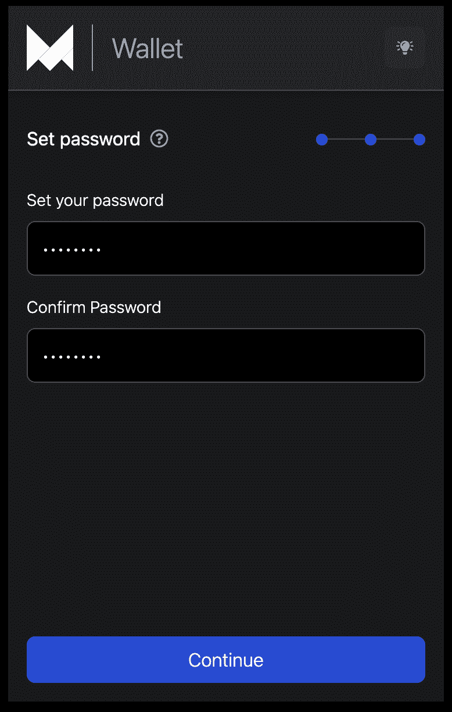

**第七步:**完成！您的 Maiar DeFi 钱包已成功创建并设置为可使用。

### 导入现有钱包

你已经有钱包了吗？

那么就没有必要创建一个新的。Maiar Wallet 扩展提供了导入现有钱包的选项。但是，要导入现有的钱包，您必须能够访问其**秘密(恢复)短语**。

Maiar 钱包有一组 24 个单词，作为您的钱包的秘密短语。使用机密短语导入现有钱包不会对您的钱包产生任何影响。

**开始使用:**

**步骤 1:** 安装了 [Maiar DeFi 钱包扩展](https://chrome.google.com/webstore/detail/maiar-defi-wallet/dngmlblcodfobpdpecaadgfbcggfjfnm)。点击“导入现有钱包”。

**第二步:**接下来，输入你的 24 个字的秘密短语。您可以一次输入一个单词，也可以使用“*粘贴*图标简单地粘贴单词。

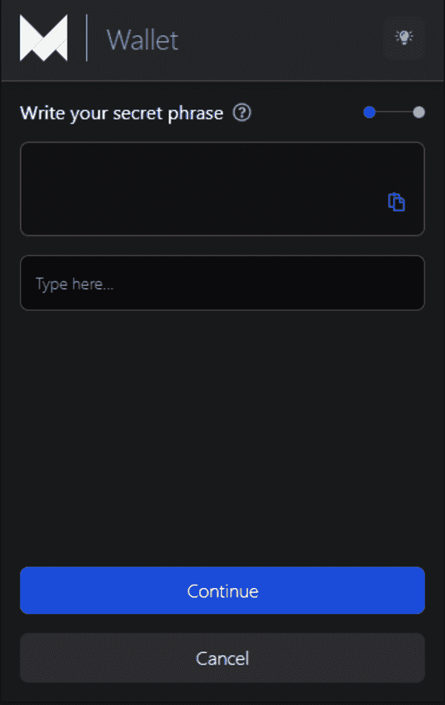

**第三步:**输入您的钱包密码并确认该密码。

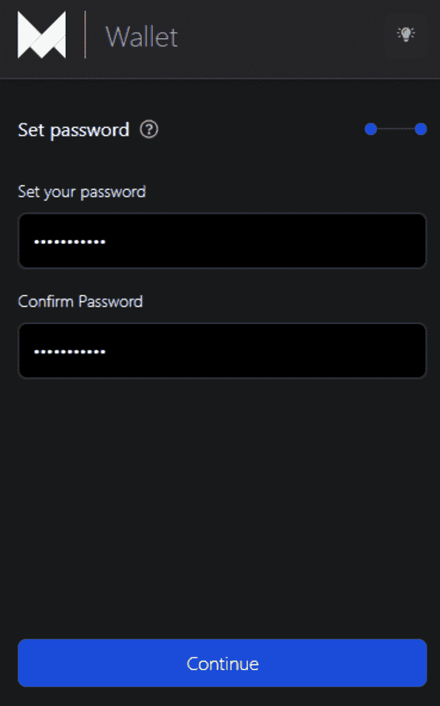

**第四步:**完成！您的 Maiar DeFi 钱包已成功导入并设置为可使用。

## 关键特性

现在，您已经在 Maiar DeFi 钱包扩展中注册了一个钱包，并且可以使用了。太好了！你可以用这个钱包做以下事情:

### 发送到钱包

这个扩展的一个关键特性是它允许你从你的钱包向另一个钱包发送资金。要使用此功能，您需要在钱包中有一些资金才能继续。

**开始使用**

**第一步:**进入 Maiar 钱包扩展，输入密码，点击***发送***。

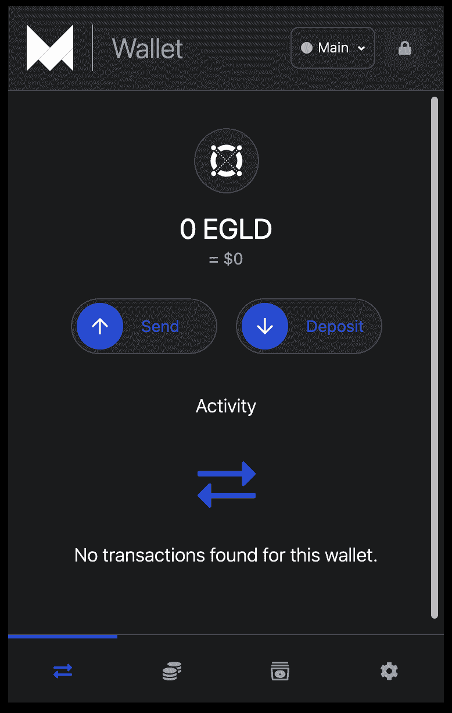

**第二步:**输入你要汇的钱包地址和金额。

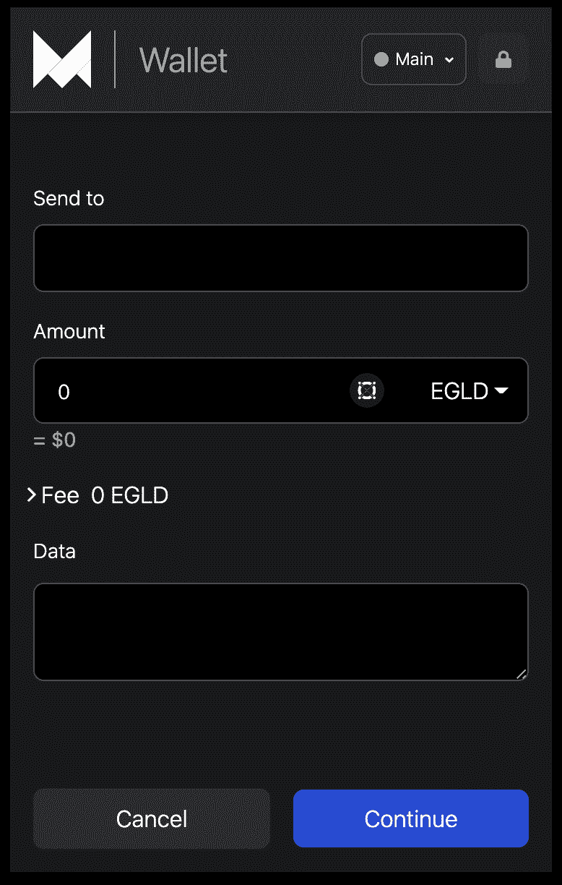

*(可选)* **第三步**:输入数据。这是交易的描述或您希望传递的任何信息。

**第四步:**点击*【继续】*按钮完成交易。

### 锁定/解锁

处于非活动状态 60 分钟后，扩展会自动锁定自己。您可以随时使用您的密码解锁。此外，您可以通过单击标题中的**“锁定”**图标来手动锁定扩展。

### 存入钱包

可以使用钱包扩展向您的钱包存款。此功能允许您分享您的 QR 码或钱包地址，以接收代币存款。要开始使用:

*   打开你的钱包。

*   接下来，点击**存款**，分享你的二维码或钱包地址。

    

### 交易历史

在 wallet 扩展仪表板上，wallet 会记录您的 wallet 中发送和接收的所有交易。如果您是新用户，在您进行第一笔交易之前，它会显示“*未找到此钱包*的交易”。

### 网络

在扩展仪表板上的设置部分，您可以连接到Elrond提供的不同网络，如 mainnet、testnet 和 devnet。

选择其中一个网络。

## 将 Maiar DeFi 钱包连接到 Maiar Exchange 应用程序

您现在可以将 Maiar Exchange 实时连接到 Maiar DeFi 钱包。有了这个连接，只需几个步骤，您就可以使用 Maiar DeFi wallet 扩展登录 Maiar exchange。请按照以下步骤继续操作:

**第一步:**进入页面右侧的 [Maiar Exchange](https://maiar.exchange/) 页面，点击*“连接”*按钮。

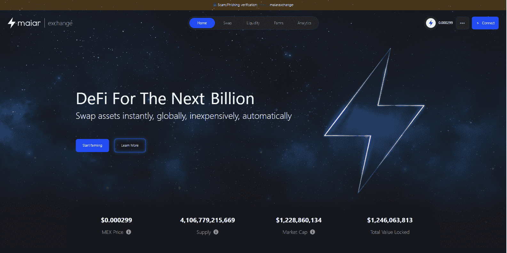

**第二步:**从显示的选项中选择 ***Maiar DeFi 钱包*** 。

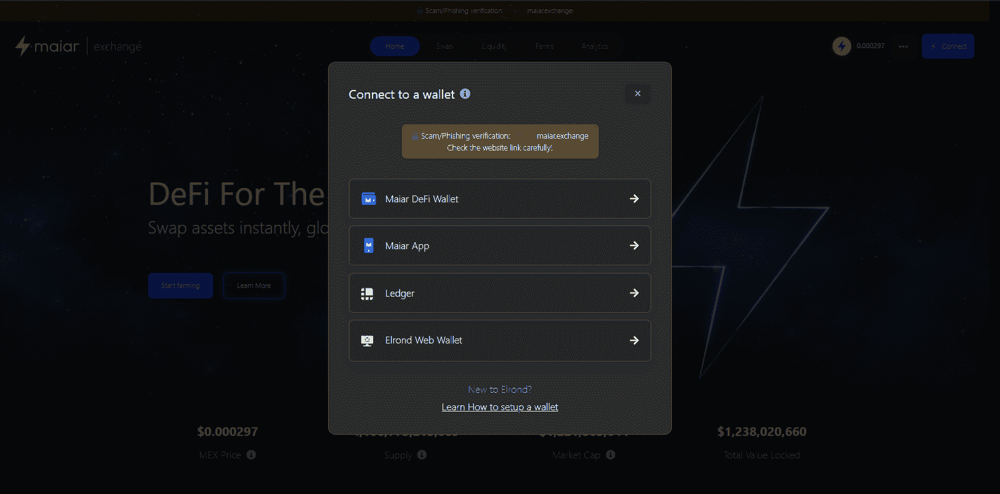

第三步:最后，输入你的密码，点击你想连接的钱包地址。

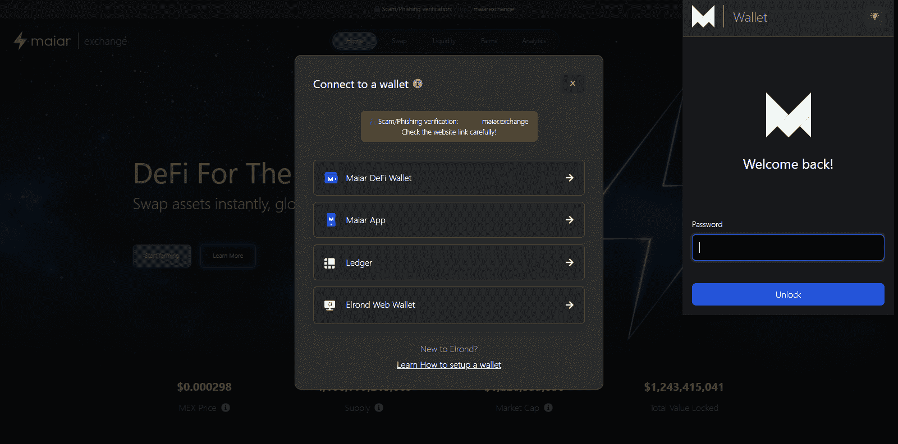

*   瞬间，Maiar Exchange 主页自动重新加载。您会注意到您的帐户已被添加到页面的右侧部分。

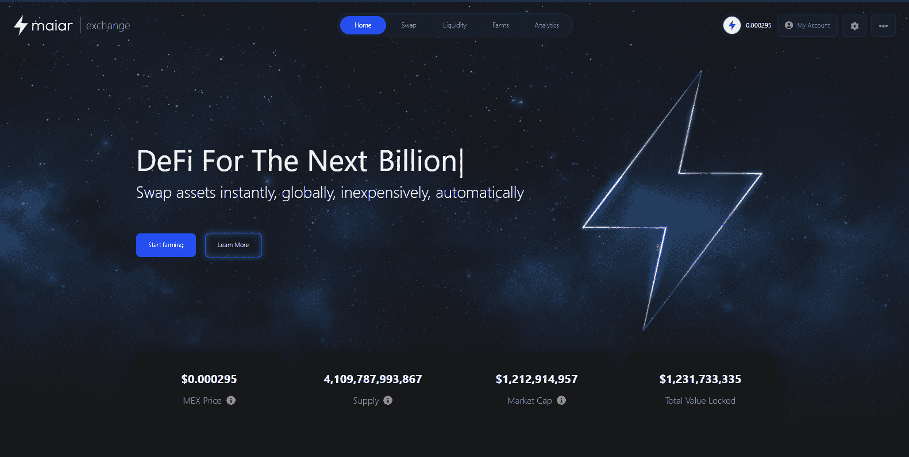

成功的🎉