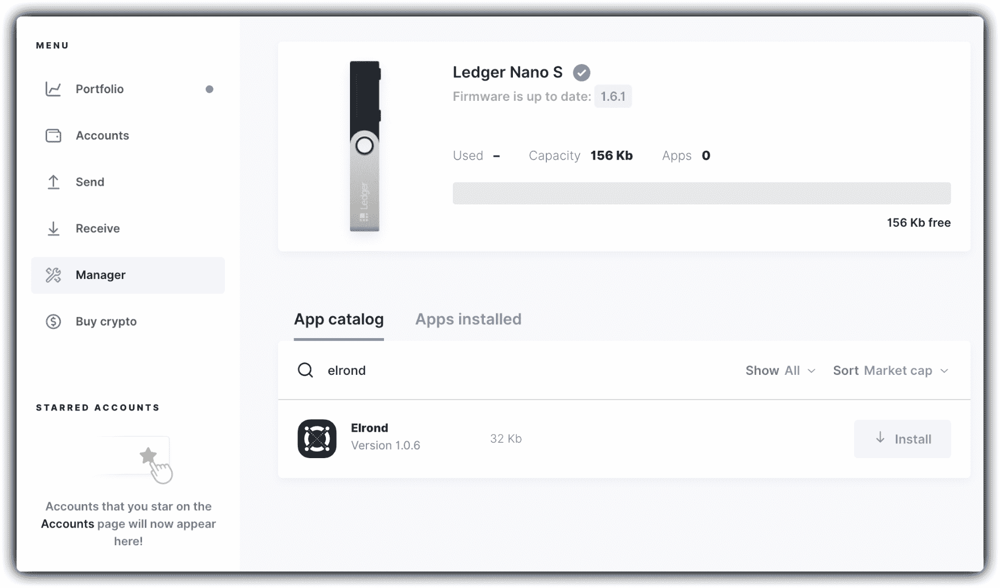
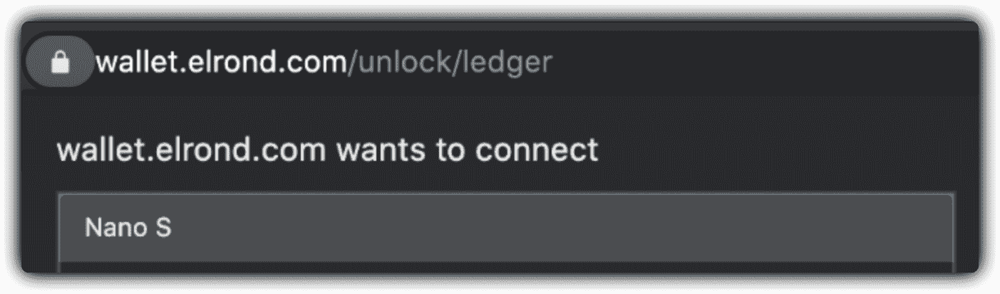
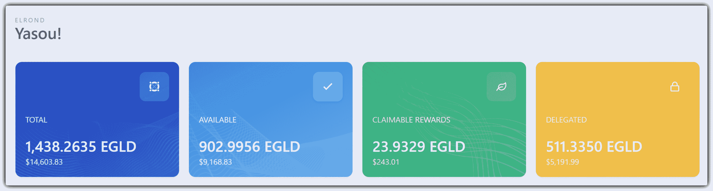
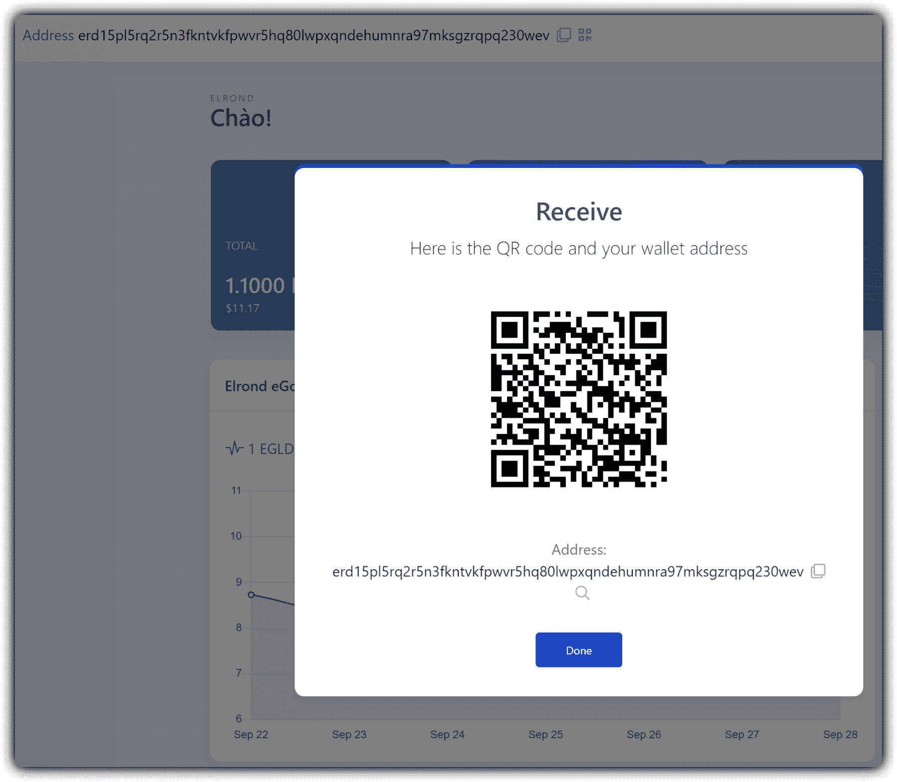

# 账本

> 原文：<https://docs.elrond.com/wallet/ledger>

 您可以通过在 Ledger Nano S 或 Ledger Nano X 设备上安装Elrond EGLD 应用程序来安全地存储您的 EGLD。我们建议使用硬件钱包来管理大量的 EGLD。

## 在你之前 begin‌

1.  [设置](https://support.ledger.com/hc/en-us/articles/360000613793)您的账本设备
2.  [下载](https://www.ledger.com/ledger-live/download)总账直播应用
3.  [用最新的 firmware‌升级](https://support.ledger.com/hc/en-us/articles/360002731113)您的设备

## **在你的账本上安装爱隆 EGLD 应用** ‌

通过在你的账本设备上安装Elrond应用程序来教它使用 EGLD。‌

*   打开账本实时应用程序
*   点击应用程序中的“管理器”部分
*   连接并解锁您的账本设备
*   如果出现提示，请通过按下两个按钮允许设备上的管理器
*   在应用目录中搜索“Elrond”
*   点击Elrond应用程序旁边的“安装”按钮
*   安装应用程序时，您的账本设备将显示“正在处理”

太棒了，你做的一切都很完美！

## 使用账本设备登录您的Elrond钱包

*   确定您的账本设备已连接到电脑
*   登录您的账本设备
*   导航至Elrond网络应用程序，按下设备上的两个按钮将其打开
*   在您的网络浏览器中导航至[https://wallet.elrond.com](https://wallet.elrond.com)
*   从登录选项中选择“账本”

*   一个弹出窗口将通知您您的账本想要连接。通过单击“连接”允许它

你的Elrond钱包将会打开。‌

## 你的 EGLD balance‌概述

登录您的钱包后，您的 EGLD 余额立即可见，并显示在易于关注的框中。

*   **可用:**可自由转让的 EGLD 余额
*   **可领取的奖励:**可领取的委托奖励
*   **委托:**委托给赌注服务提供商的 EGLD 金额
*   **Total:** 与该地址相关的 EGLD 的总量，above‌的总和

## 使用 Ledger‌发送交易

在埃尔隆网 wallet:‌

*   点击“发送”
*   输入目的地地址和金额
*   点击发送
*   在下一个屏幕中，点击“确认并检查您的账本”

在你的账本上，device:‌

*   在您的账本设备上查看收款人地址、金额和费用
*   通过按下两个 buttons‌来签署交易

太棒了，您的交易现在正通过您的账本设备发送。

## **接收钱包里的 egld**‌

如上所述，登录您的钱包后，您将能够看到您的钱包地址并与其他人共享，这样他们就可以向您发送 EGLD。‌

您的地址会立即出现在钱包的顶部，显示为“地址 erd1 ...”。您可以按下复制按钮(两个重叠的方块)来复制地址。‌

你也可以点击左侧的“接收”来查看地址的二维码，扫描后可以显示公共地址。

## **需要帮助吗？** ‌

*   通过您的[首选频道](https://linktr.ee/Elrond)联系Elrond