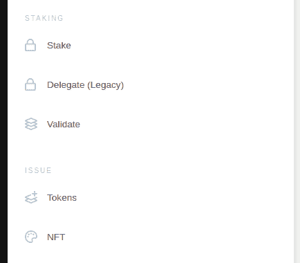
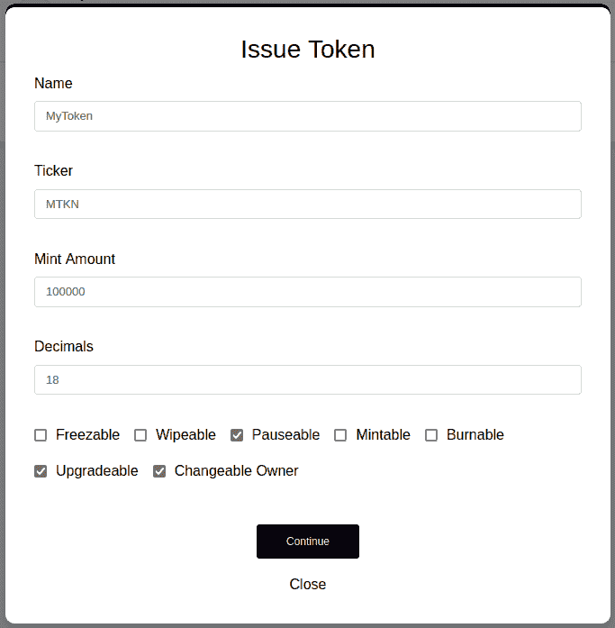
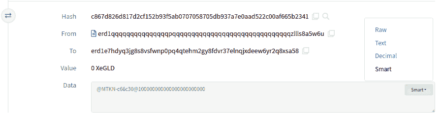
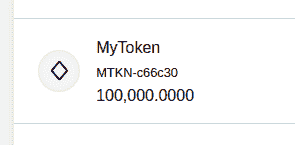
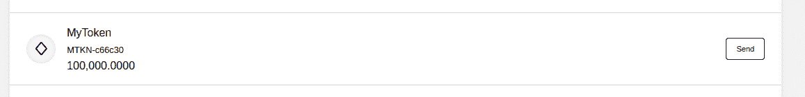
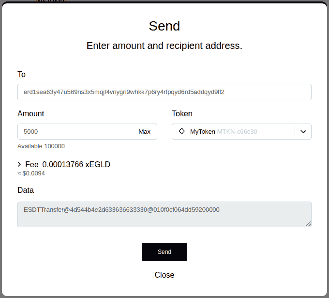

# 网络钱包代币

> 原文：<https://docs.elrond.com/wallet/create-a-fungible-token>

 ## **简介**

**ESDT** 代表*Elrond标准数字代币*。

Elrond网络原生支持定制代币的发行，不需要 ERC20 等合约，但处理相同的用例。只需几个步骤，您就可以从[Elrond网上钱包](https://wallet.elrond.com/)创建并发行 ESDT 代币。让我们复习一下这些步骤。

## **先决条件**

*   Elrond网络上的钱包。
*   0.05 EGLD 发行费
*   交易费用

## **从网络钱包创建可替换代币**

首先，打开[Elrond网络钱包](https://wallet.elrond.com/)。如果没有钱包，您可以创建一个新的钱包或导入现有的钱包。这里有一份[指南](https://docs.elrond.com/wallet/web-wallet/)帮你导航。

在左侧栏，您会注意到**问题**部分。

点击**代币**。

##### 注

网络钱包将处理交易的准备工作。因此，如果您想要一个具有 10 位和 2 位小数的代币，您只需将 10 作为供应量，2 作为小数位数。

创建代币时，您需要提供代币名称、股票代码、初始供应量和小数位数。除此之外，还应该设置代币的属性。

有用的资源:

*   [代币参数格式](/tokens/esdt-tokens#parameters-format)——关于长度、字符集等的约束。
*   [代币属性](/tokens/esdt-tokens#configuration-properties-of-an-esdt-token) -这些属性代表什么。

输入所需的详细信息。接下来，点击 ***继续*** 按钮继续。如果一切顺利的话，你必须检查交易并签字。

一旦交易被处理，您的代币将被发放。

### **寻找代币标识符**

代币的代币标识符是唯一的。它由代币 ticker 组成，一个`-`字符，后跟 6 个随机十六进制字符。例子:`MTKN-c66c30`。

因为代币标识符是不确定的，所以只有在发出之后才能找到它。有两种方法可以找到它:

1.  在问题交易的浏览器页面上，您将看到一个智能合约结果，其中有一个类似于:`@4d544b4e2d373065323338@152d02c7e14af6800000`的数据字段。在右侧，选择`Smart`，您将能够看到解码后的参数。在这个例子中，代币标识符是`MTKN-c66c30`。

2.  在 Web Wallet 中，从左侧边栏转到`TOKENS`选项卡，您可以在那里看到代币，包括其标识符。

## **从钱包里转移一个代币**

您可以将一定数量的代币转移到另一个帐户。首先，打开[Elrond网络钱包](https://wallet.elrond.com/)。

导航至`Tokens`选项卡，点击`Send`选择您要转移的代币。

在弹出窗口上，介绍收件人和您要发送的金额。然后按下`Send`。

一旦交易成功执行，接收者应该收到一定数量的代币。

## **从网络钱包管理代币**

在撰写本文时，代币所有者的仪表板仍在建设中。同时，代币操作必须手动完成，遵循此处描述的[交易格式。](/tokens/esdt-tokens/#management-operations)