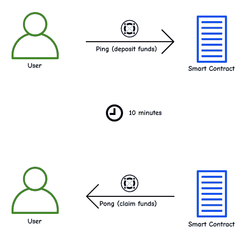
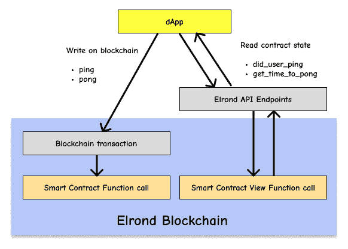
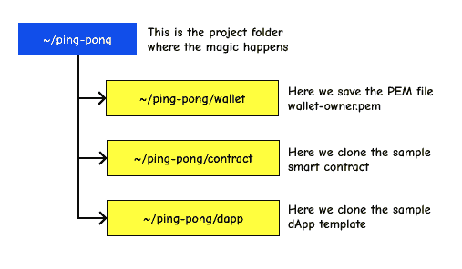

# 在 15 分钟内建立一个 dApp

> 原文：<https://docs.elrond.com/developers/tutorials/your-first-dapp>

 让我们在Elrond区块链上构建你的第一个去中心化应用

##### 重要

请[创建一个样本**所有者钱包**](/wallet/web-wallet) 并准备好您的安全短语(24 个单词)。

我们将在 Devnet 上工作，你应该在这里管理你的网络钱包。

该指南还提供视频格式:

[https://www.youtube-nocookie.com/embed/IdkgvlK3rb8](https://www.youtube-nocookie.com/embed/IdkgvlK3rb8)

### **dApp 描述**



**乒乓应用**是一个非常简单的去中心化应用，允许用户将特定数量的代币(默认为 1 xEGLD)存放到智能合约地址，并在特定时间内锁定它们(默认为 10 分钟)。经过这段时间后，用户可以取回相同数量的代币。给合约送资金叫`ping`。索回相同的金额称为`pong`。

其他规则:

*   用户在`pong`之前只能`ping` **一次**(所以没有多次 pings)。
*   只能对**设定的数量**进行`ping`编辑，不能多，也不能少。

也许你注意到了存款的默认金额是 1 xEGLD，而不是Elrond官方的 1 EGLD，这是因为，出于测试目的，我们使用Elrond Devnet，这是一个与Elrond官方区块链 Mainnet 相同的测试环境。在这里，货币是 **xEGLD** ，这只是一个测试代币，一文不值。

## **Elrond dApp 架构**



### **应用层(前端)**

对于 web 应用程序，我们将有两个页面:

*   *登录*页面——在这里我们可以使用账本、网络钱包或 Maiar 钱包进行身份验证
*   *仪表板*页面——在这里我们可以乒或乓，如果我们已经存入，然后我们会看到一个倒计时器，直到时间间隔清零。

### **区块链层(后端)**

我们将创建一个智能合约，可以处理存款(`ping`)、索赔(`pong`)和状态操作(`did_user_ping`、`get_time_to_pong`)。比方说，目前，这个智能合约在 dApp 中扮演 API 的角色。这也是我们的业务逻辑所在。

Elrond *devnet* 是一个由我们社区维护的公共测试网络，任何开发者都可以在真实世界环境中测试他们的智能合约和 dApps。

## **设置环境**

### **项目结构**

设置环境

首先让我们为我们的项目创建一个新文件夹，我将其命名为`ping-pong`。

```rust
mkdir -p ping-pong/wallet
cd ping-pong/wallet 
```

最后，我们会有三个子文件夹:wallet、contract 和 dapp。为了方便起见，我们将把所有者的 wallet 密钥库保存在 wallet 文件夹中。



### **软件必备**

软件先决条件

在我们的例子中，我们将使用 Ubuntu 20.04 。MacOs 也可以工作(跳到本节最后一段)。我们需要安装`python 3.8`、`python-pip`和`libncurses5`。对于前端应用程序，我们将使用基于 [React JS](https://reactjs.org/) 的应用程序模板，因此我们将需要`nodejs`和`npm`。

首先，我们确保安装了操作系统必备组件:

```rust
sudo apt-get update 
sudo apt install libncurses5 build-essential python3-pip nodejs npm python3.8-venv 
```

我们还需要Elrond命令行工具`erdpy`，它有助于签署交易、部署智能合约、管理钱包、账户和验证器。我们将使用它来部署我们的智能合约。可以使用Elrond文档页面[https://docs . elrond . com/SDK-and-tools/Erdpy/installing-erd py](https://docs.elrond.com/sdk-and-tools/erdpy/installing-erdpy)安装 erd py

我们将下载并运行`erdpy`安装程序

```rust
wget -O erdpy-up.py https://raw.githubusercontent.com/ElrondNetwork/elrond-sdk-erdpy/master/erdpy-up.py
python3 erdpy-up.py 
```

重启用户会话以激活`erdpy`

```rust
source ~/.profile 
```

为了在 **MacOs** 上安装`erdpy`，你需要确保你已经在你的系统上安装了`python 3.8`和`pip`。然后，使用`pip`安装最新的`erdpy`版本。

```rust
pip3 install --user --upgrade --no-cache-dir erdpy 
```

如果您遇到任何与`pynacl`包相关的错误，请确保您已经安装了`libsodium`。

```rust
brew install libsodium 
```

### **创建主人钱包**

我们现在已经安装了所有的先决条件，让我们创建一个所有者的钱包 **PEM 文件**。

智能合约只能由所有者在区块链上部署，因此我们将在这里创建一个所有者钱包[。如果需要，所有者也可以在以后更新合约。](https://devnet-wallet.elrond.com)

让我们转到Elrond钱包，点击**“创建新钱包”**，写下可以帮助我们检索钱包的安全短语(24 个单词)，以及 JSON 密钥库的密码(我们将保存在`~/ping-pong/wallet folder`)。我们应该能够看到我们新的Elrond钱包所有者地址，在本例中是 *erd1.......*

我们还可以生成一个私钥 PEM 文件，这样我们就不需要每次确认交易时都输入钱包密码。

```rust
cd ~/ping-pong/wallet 
erdpy --verbose wallet derive ./wallet-owner.pem --mnemonic 
```

当系统提示时，我们将输入我们的 24 个密码,然后会创建一个新的 PEM 文件。该命令要求您输入全部 24 个单词，每个单词用空格隔开。

为了在区块链上发起交易，我们需要一些资金，每笔交易都需要一笔很小的费用，在区块链这被称为**气**。在 devnet 钱包上，我们有一个**龙头**，允许你为我们的应用程序获得免费的测试资金。我们可以每 24 小时请求 10 个 xEGLD，所以让我们现在就请求 10 个 xEGLD。我们现在检查交易是否成功，是的，我们看到我们的 devnet 钱包中现在有 10 xEGLD。

## **区块链层-智能合约**

我们的所有者钱包现在完全设置好了，我们可以继续我们的后端，区块链层。

### **克隆模板**

克隆乒乓样本智能合约

先说我们的智能合约。我们将首先从这里克隆示例合约库[https://github.com/ElrondNetwork/ping-pong-smart-contract](https://github.com/ElrondNetwork/ping-pong-smart-contract)

```rust
cd ~/ping-pong
git clone https://github.com/ElrondNetwork/ping-pong-smart-contract contract
cd contract/ping-pong 
```

### **打造智能合约**

我们现在有了智能合约的源代码，但是我们需要将它编译成Elrond虚拟机可以运行的二进制文件。虚拟机可以运行 Web 汇编代码，所以我们需要将我们的 Rust 源代码编译成 Web 汇编(WASM)。

运行以下命令，将 rust smart 合约构建到一个 *wasm 文件*中。

```rust
erdpy contract build 
```

在输出的最后一行，我们会看到:

```rust
INFO:projects.core:WASM file generated: output/ping-pong.wasm 
```

运行这个命令行后，我们看到生成了一个 wasm 文件。这个文件包含我们的智能合约的运行时代码。

### **定制和部署**

在Elrond发展网上部署智能合约下一步是在区块链部署合约。

**自定义变量**

可选地，我们可以自定义`erdpy.json`中的默认参数:

```rust
{
    "configurations": {
        "default": {
            "proxy": "https://devnet-api.elrond.com",
            "chainID": "D"
        }
    },
    "contract":{
        "deploy":{
            "verbose": true,
            "bytecode": "output/ping-pong.wasm",
            "recall-nonce": true,
            "pem": "../../wallet/wallet-owner.pem",
            "gas-limit": 60000000,
            "arguments": [1000000000000000000, 600],
            "send": true,
            "outfile": "deploy-testnet.interaction.json"
        }
     }
} 
```

确保您的 *owner wallet PEM 文件*位于正确的文件夹中，智能合约已建立，让我们开始部署。现在，让我们继续使用默认值。我们将运行:

```rust
erdpy contract deploy 
```

我们将查看日志输出。我们有两个需要注意的元素:合约地址和交易散列。让我们在 [Devnet Explorer](https://devnet-explorer.elrond.com) 中检查它们。

Devnet Explorer 将是你在Elrond区块链上开发 dapp 的最好朋友，因为你将首先在 Devnet 上部署和测试你的 dapp。

INFO:accounts:account . sync _ nonce()INFO:accounts:account . sync _ nonce()done:32 INFO:CLI . contracts:contracts:合约地址:erd 1 qqqqqqqqqqqpgq 0 hmfvuyg s34 cgqsvg g6 fpq 9 C5 mff H4 y 04 cysagr 6 cn INFO:utils:在Elrond发展网浏览器中查看此合约地址:[https://Devnet-Explorer . elrond . com/accounts/erd 1 qqqqqqqqqqqqqpgq 0 HMF vuyg s34 cgqsvgg 6](https://devnet-explorer.elrond.com/accounts/erd1qqqqqqqqqqqqqpgq0hmfvuygs34cgqsvgg6fpq9c5mffh4y04cysagr6cn)

智能合约现已部署在区块链上。我们可以使用区块链交易与它进行交互，以便调用智能合约功能`ping`或`pong`。

智能合约源代码位于`ping-pong-smart-contract/ping-pong/src/ping_pong.rs`

有两个主要的函数:`ping`和`pong`，它们是通过区块链交易调用的。

我们在智能合约中还定义了另外两个函数:`get_time_to_pong`和`did_user_ping`，这些视图函数是使用**Elrond API**(*T5【https://devnet-api.elrond.com/vm-values/query】T6*)调用的。

## **应用层-Web App**

好了，让我们进入应用层。

### **克隆样本 App**

我们将克隆一个非常简单的 dApp 模板，实现对我们新部署的智能合约的调用。

```rust
git clone https://github.com/ElrondNetwork/dapp-template dapp
cd dapp 
```

### **配置 app**

自定义智能合约地址

```rust
nano src/config.tsx 
```

我们来看看第一条指令:

```rust
export const contractAddress = 
  'erd1qqqqqqqqqqqqq...'; 
```

我们将把它更改为 erdpy 合约部署后显示的合约地址:

```rust
export const contractAddress = 
'erd1qqqqqqqqqqqqqpgq0hmfvuygs34cgqsvg...ffh4y04cysagr6cn'; 
```

保存并关闭`config.tsx`,我们就可以开始第一次构建了。

### **打造 dApp**

我们将首先安装依赖项:

```rust
npm install 
```

然后我们将启动一个开发服务器来测试我们的新 dApp

```rust
npm run start 
```

**在本地机器上运行它(或者在您的服务器上托管它)**如果您在本地机器上启动开发服务器，那么在您的浏览器中打开 [http://localhost:3000](http://localhost:3000) 。如果你在自己的服务器上启动它，那么你可以访问 [http:// <ip>:3000</ip>](http://ip:3000) 。构建的版本只包含静态文件，所以任何主机提供商都可以。

启动开发服务器后，当您看到登录屏幕时，这意味着应用程序已经启动并正在运行。

## **测试你的应用**

我们将使用测试钱包登录。如果需要，您可以重复使用同一个所有者的钱包，或者按照创建所有者钱包时所遵循的相同步骤创建一个新的钱包。

### **乒特性**

登录后，我们将看到仪表板，在那里我们可以看到 **Ping** 按钮。

单击 Ping 按钮，您将被重定向到 web wallet、maiar wallet 或您的身份验证设备上的身份验证页面。将创建一个新交易，并要求您确认。该交易将余额从您的钱包转移到智能合约地址。这些资金将被锁定一段时间。注意数据字段，我们在这里调用智能合约函数`ping`。在您确认交易后，将出现一条成功消息，资金将被锁定。

**等待时间间隔**你可以看到你需要等待的时间。

### **乒乓特性**

时间间隔过后，您可以通过单击 Pong 按钮来申请资金。另一个区块链交易将等待处理，这一次金额将为零，因为我们只需调用`pong`函数(在*数据*字段中指定)。交易将触发成功消息，资金将返回到钱包。

## **下一步何去何从？**

本指南的目的是为您发现Elrond的技术能力和开发套件提供一个起点。继续阅读下一篇文档，深入了解。我们欢迎您对栈溢出的问题和询问:[https://stackoverflow.com/questions/tagged/elrond](https://stackoverflow.com/questions/tagged/elrond)。

分解本指南，了解有关如何扩展智能合约、钱包和Elrond工具的更多信息。[https://docs.elrond.com](/)